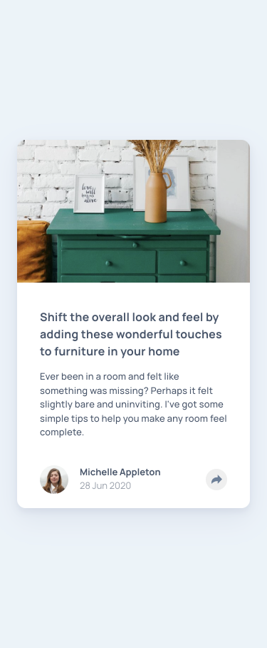
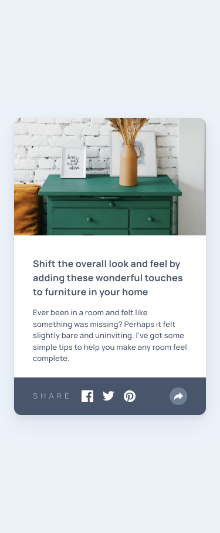
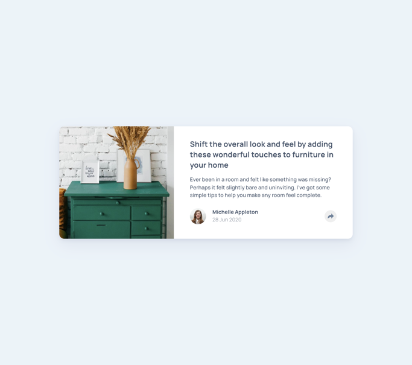
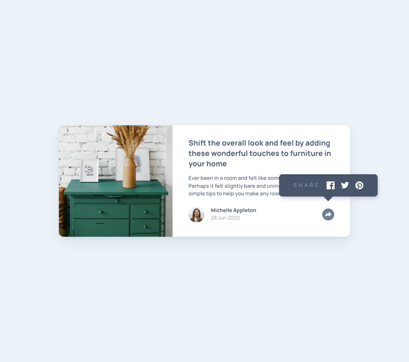

# Frontend Mentor - Article preview component solution

This is a solution to the [Article preview component challenge on Frontend Mentor](https://www.frontendmentor.io/challenges/article-preview-component-dYBN_pYFT). Frontend Mentor challenges help you improve your coding skills by building realistic projects. 


## Table of contents

- [Frontend Mentor - Article preview component solution](#frontend-mentor---article-preview-component-solution)
  - [Table of contents](#table-of-contents)
  - [Overview](#overview)
    - [Screenshot](#screenshot)
    - [Links](#links)
    - [Built with](#built-with)
    - [What I learned](#what-i-learned)
    - [Useful resources](#useful-resources)


## Overview

It's a front-end challenge from Frontend Mentor to build a responsive article preview component. The teaser is responsive and can be used on any screen size. It is styled as a card and contains an image, title, description and footer. The card is interactive in that when user clicks on share button, the social media buttons are displayed and when the user clicks anywhere outside the share button, social media buttons are hidden. All of this is implemented using CSS and vanilla JavaScript. Finally, the card is also accessible to screen readers.


### Screenshot

<p>
    
    
    <p>
    
    
</p>


### Links

- Solution URL: [https://github.com/py-code314/article-preview-component](https://github.com/py-code314/article-preview-component)
- Live Site URL: [https://artcle-preview-component.netlify.app/](https://artcle-preview-component.netlify.app/)


### Built with

- Semantic HTML5 markup
- Sass
- Gulp
- Vanilla JavaScript
- Flexbox
- Mobile-first workflow


### What I learned

- This was my first project using Gulp to compile Sass files
- I had an issue with deploying the Github repo to Netlify and I resolved it by adding this additional code to 'gulpfile.js':
```
function build(cb) {
  gulp.series(styles)(cb);
}

exports.build = build;
```
- I also had to change the Publish Directory in Netlify to root directory '.'(a single dot) for successful deployment


### Useful resources

- All the code written in 'gulpfile.js' is taken from a [Kevin Powell video tutorial](https://www.youtube.com/watch?v=QgMQeLymAdU)
- I used Josh Comeau's [CSS Reset](https://www.joshwcomeau.com/css/custom-css-reset/) to remove default browser styles

